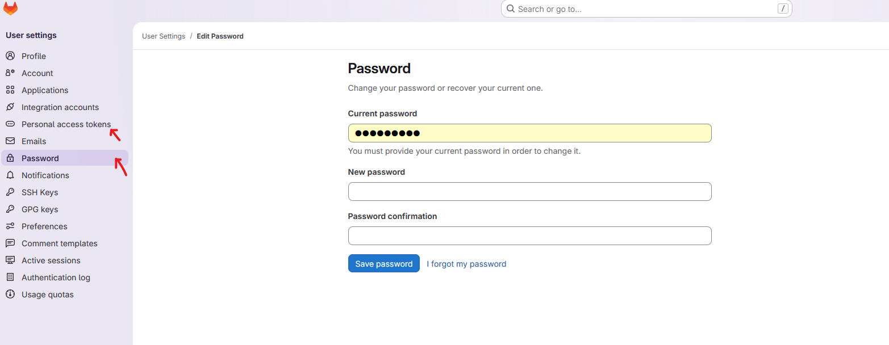

# Chalmers Gitlab Repo

## Create account

Sign in on https://git.chalmers.se/ using **cid**

## Setting up account for using repos locally

Before cloning a repository locally on your computer for the first time, setup a password or personal access token

